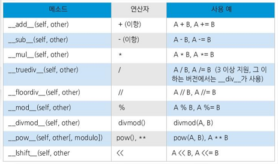
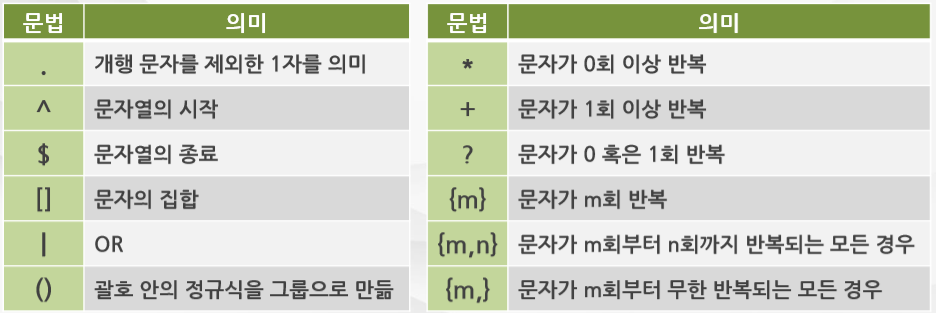
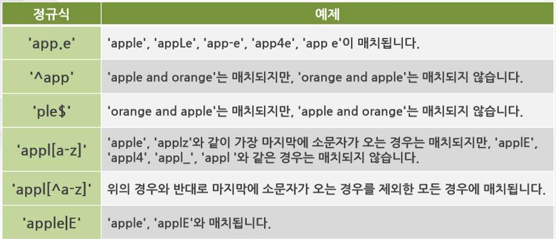
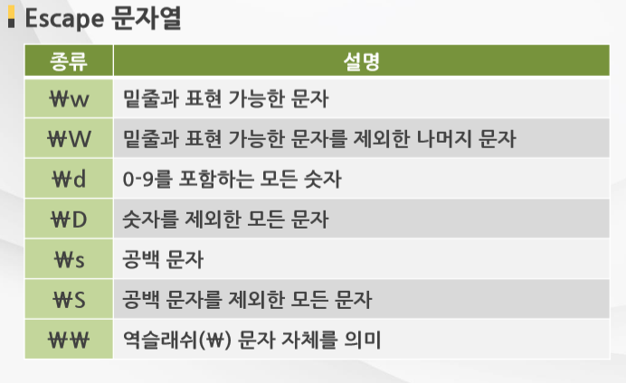
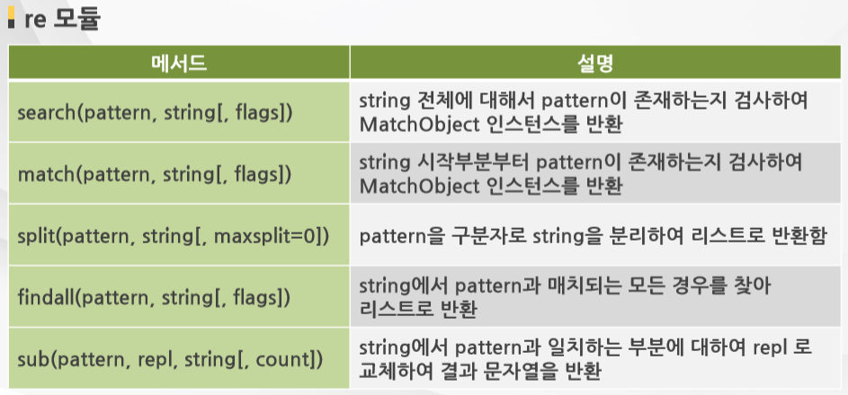

# 자료형
### 수치
- int, float, complex, 연산자(+, -, *, /, //, %, **, =) 
###  +, * 연산자
```python
print('py''thon')   # python - 중간에 + 생략되어 있다.
print('py' * 3)     # pypypy
```
### 문자 인덱싱 & 슬라이싱
```python
""" 줄바꿈
적용됨
"""
tempStr = 'python'
print(tempStr[0])  # p
print(tempStr[5])  # n
print(tempStr[1:4])  # yth
print(tempStr[-2:])  # on
```
#### - 유니코드
- 모든문자열(string)이 기본적으로 유니코드이다.
- 유니코드 이외의 인코딩이 있는 문자열은 bytes로 표현된다.

### 리스트
- append, insert, extend, index, count, pop, remove, sort
```python
colors = ['red', 'green', 'gold']
print(colors)  # ['red', 'green', 'gold']

colors.append("blue")
print(colors)  # ['red', 'green', 'gold', 'blue']

colors.insert(1, 'black')
print(colors)  # ['red', 'black', 'green', 'gold', 'blue']

colors.extend(['white', 'gray'])
print(colors)  # ['red', 'black', 'green', 'gold', 'blue', 'white', 'gray']

print(colors.index("black"))  # 1
# 검색범위 안에 값이 없으면 error
# print(colors.index("black", 3, 4))  # ValueError: 'black' is not in list

colors.append('red')
print(colors.count('red'))  # 2

print(colors)           # ['red', 'black', 'green', 'gold', 'blue', 'white', 'gray', 'red']
print(colors.pop())     # red
print(colors)           # ['red', 'black', 'green', 'gold', 'blue', 'white', 'gray']
```

### 세트 
- 집합과 동일
- 순서가 없음
- 제공되는 메서드는 리슽와 유사하면, 추가적으로 교집합과 합집합 메서드 제공
```python
a = {1, 2, 3}
b = {3, 4, 5}
print(a.union(b))           # 합집합 - {1, 2, 3, 4, 5}
print(a.intersection(b))    # 교집합 - {3}
```
### 튜플
- 튜플은 리스트와 유사하나, 읽기전용
- 속도는 빠름, 제공메서드 count, index 정도임
```python
c, d = 1, 2
print(c, d)  # 1 2
c, d = d, c
print(c, d)  # 2 2
```

### 딕셔너리(객체랑 비슷함)
- items(), keys(), values(), del, clear()
```python
color = dict(apple='red', banana='yello')
# color = {'apple': 'red', 'banana': 'yello'}
print(color["apple"])  # red
color["apple"] = 'green'
print(color["apple"])  # green
print(color.keys())  # dict_keys(['apple', 'banana'])
print(color.values())  # dict_values(['green', 'yello'])

for k, v in color.items():
	print(k, v)  # apple green, banana yello
color.__delitem__('apple')
color.clear()
```
### 부울(bool)
- 참, 거짓

### 얕은복사 vs 깊은복사
- 얕은복사 - 주소가 복사되어 객체를 공유하는 경우 ( 일반적인 a = b)
- 깊은복사 - 객채를 복사하는 (b = a[:])

# 함수
- 함수의 선언은 def로 시작하고 콜론(:)로 끝남
- 함수의 시작과 끝은 코드의 들여쓰기로 구분
- 시작과 끝을 명시해 줄 필요가 없음
```python
"""
def <함수명>(인수1, 인수2, ...인수n):
    <구문>
    return <반환값>
"""

def multiply(a, b):
	return a * b

print(multiply(10, 20))  # 200
```

### 인수모드
- 기본인수 : 인수값이 없을때 default 값을 적용
```python
def sum1(a=10, b=20):
    return a * b

print(sum1())  # 100
print(sum1(20))  # 200
```
- 키워드인수
    * 인수의 이름으로 값을 전달하는 방식
    * 인수에 순서에 상관없이 변수의 이름으로 특정인수를 전달 할 수 있다.(가동성 짱)
```python
def connectURL(server, port):
    # strUrl = "http://" + server + ":" + port
    strUrl = "http://{}:{}".format(server, port)
    return strUrl

print(connectURL("test.com", "8080"))   # http://test.com:8080
print(connectURL(port="8080", server="test.com"))   # http://test.com:8080
```
- 가변인수 리스트 
    * 인수의 개수가 정해지지 않는 가변 인수를 전달
    * `*`를 사용하며 인수는 튜플형식으로 전달됨 ( a, b, c) => 이딴식
```python
def union2(*ar):
    res = []
    for item in ar:
        for x in item:
            if not x in res:
                res.append(x)
    return res

print(union2("HAM", "EGG", "SPAM")) # ['H', 'A', 'M', 'E', 'G', 'S', 'P']  
```
- 정의되지 않은 인수처리 
    - `**`사용하여 정의되지 않는 인수를 딕셔너리 형식으로 전달.
    - 정의되지 않은 인수는 가장 마지막 인수여야 한다. 
```python
def userURLBuilder(server, port, **user):
    strUrl = "http://{}:{}/?".format(server, port)
    for key in user.keys():
        strUrl += "{}={}&".format(key, user[key])
    return strUrl

# http://test.com:8080/?id=userid&passwd=1234&
print(userURLBuilder('test.com', '8080', id='userid', passwd='1234'))   
# http://test.com:8080/?id=userid&passwd=1234&name=mike&
print(userURLBuilder('test.com', '8080', id='userid', passwd='1234', name='mike')) 
``` 

### 함수종류
- 람다함수
```python
""" lambda 인수: <구문> """
g = lambda x, y: x * y
print(g(2, 2))  # 4
print((lambda x: x * x)(3))  # 9
```
- 재귀적(recursive)함수호출 : 함수내부에서 자기자신을 호출하는 함수

- pass 구문 :pass 문은 아무것도 하지 않습니다. 문법적으로 문장이 필요하지만, 프로그램이 특별히 할 일이 없을 때 사용할 수 있다.
```python
while True:
    pass  # Busy-wait for keyboard interrupt (Ctrl+C)
...

"""최소한의 클래스를 만들 때 흔히 사용됩니다."""
class MyEmptyClass:
    pass
...

"""
pass가 사용될 수 있는 다른 장소는 새 코드를 작업할 때 
함수나 조건부 바디의 자리를 채우는 것인데, 
여러분이 더 추상적인 수준에서 생각할 수 있게 합니다. 
pass 는 조용히 무시됩니다:
"""
def initlog(*args):
    pass   # Remember to implement this!
```
- __doc__속성과 help함수
    - help 함수를 이용해 함수의 설명을 볼 수 있음(사용자 정의 함수 )
```python
help(print)

def plus(a, b):
	return a + b

"""
Help on function plus in module __main__:
plus(a, b)
"""
help(plus)
```

### 이터레이터(interator)
- 내부반복문을 관리해 주는 개체로 순회 가능한 객체의 요소를 순서대로 접근할 수 있다.
- 대표적으로 iterable한 타입 - list, dict, set, str, bytes, tuple, range
- next(it) 또는 it.__next__() 로 하나 하나씩 접근가능하다. 
```python
s = 'abc'
print(type(s))  # 'str'
it = iter(s)  # <class 'str'> => iterable => <class 'str_iterator'> 변환
print(type(it))  # <class 'str_iterator'>
print(next(it))  # a
print(it.__next__())  # b
print(next(it))  # c
# print(next(it))     # 예외발생 StopIteration

# class 로 구현한 예제
class MyCollection:
	def __init__(self, count):
		self.size = count
		self.data = list(range(self.size))
	
	def __iter__(self):
		self.index = 0
		return self
	
	def __next__(self):
		if self.index >= self.size:
			raise StopIteration
		
		n = self.data[self.index]
		self.index += 1
		return n

coll = MyCollection(10) # [0, 1, 2, 3, 4, 5, 6, 7, 8, 9]
print(list(coll))
# for x in coll:
# 	print(x)
```

### 제너레이터(Generator)
- return 대신 yield라는 구문을 이용해 함수 객체를 유지한 체 값을 호출자에게 넘겨줌
- 값을 넘겨준 후 함수 객체는 그대로 유지됨
- 함수의 상태를 유지하고 다시 호출할 수 있기 때문에 순회 가능한 객체를 만들 때 매우 편리
```python
def square_number(nums):
	for i in nums:
		yield i

numbers = square_number([1, 2, 3, 4, 5])

print(type(numbers))    # <class 'generator'>
# print(sum(numbers))     # 15
print(next(numbers))       # 1
print(next(numbers))       # 2
print(next(numbers))       # 3
print(next(numbers))       # 4
print(next(numbers))       # 5
print(next(numbers))       # 예외발생 - print(next(numbers))       # 예외발생
```

# 제어문
### if 문  
```python
# if 문
"""
if <조건식>:
	<구문>
"""
value = 10
if value > 5:
	print('value is bigger than 5')     # value is bigger than 5

"""
if <조건식 1>:
	<구문 1>
elif <조건식 2>:
	<구문 2>
else:
	<구문 3>
"""

score = int(input('Input Score: '))     # 사용자로부터 정수값을 입력받음
if 90 <= score <= 100:
		grade = 'A'
elif 80 <= score < 90:
		grade = 'B'
elif 70 <= score < 80:
		grade = 'C'
elif 60 <= score < 70:
		grade = 'D'
else:
		grade = 'F'

# input 80 / Grade is B
print('Grade is {}'.format(grade))
```
> 파이썬 조건식 표현방법 <br>
    - **70<= score < 80** 간단명료함. <br>
    - 70<= score and score < 80

- 단축평가 - 조건식 전체를 판단하지 않고 순척적으로 진행한다. 좌 => 우
    - `and` 와 `or`는 단축평가로 수행되도록 보장
    - x and y : x가 false 인 경우, y 값은 평가하지 않음
    - x or y : x가 True 인 경우, y 값은 평가하지 않음

### 조건식의 참/거짓 판단
- false : 0, 0.0, (), [], {}, '(빈문자열)', None인 경우
- true : false인 경우를 제외한 값

### for문
```python
"""
시퀀스형 객체를 순차적으로 순회
for <아이템 I> in <시퀀스형 객체 S>:
	<구문>
"""
l = ['Apple', 100, 15, 23]
# Apple | 100 | 15 | 23 
for i in l:
	print(i)
	
d = {"apple": 100, "orange": 200, "Banana": 300}
# apple / 100 | orange / 200 | Banana / 300
for k, v in d.items():
	print('{} / {}'.format(k, v))
```
- break - 반목문 내부 클록을 벗어남
```python
# item: 1 | item: 2 | item: 3 | item: 4 | item: 5 
for i in range(1, 10):
	if i > 5:
		break
	print('item: {}'.format(i))
```
- continue : 내부 블록을 수행하지 않고 다음차례를 순회.
```python
# item: 1 | item: 3 | item: 5 | item: 6 | item: 7 
for i in range(1, 10):
	if i % 2 == 0:
		continue
	print('item: {}'.format(i))
```
- else : 반복문 수행도중 break로 인하여 중간에 종료되지 않고 끝까지 수행되었을때, else 블록을 수행
```python
# item: 1 | item: 3 | item: 5 | item: 6 | item: 7 | Exit without break!    
for i in range(1, 10):
	if i % 2 == 0:
		continue
	print('item: {}'.format(i))
else:
	print('Exit without break!')    # 외부루프문장
```
- 리스트 내장
```python
"""
기존 시퀀스 객체를 이용하며 추가적인 연산을 통하여 새로운 리스트 객체 생성
if문을 옵션으로 filter 처럼 사용가능함.
[<표현식> for <아이템> in <시퀀스 객체> (if <조건식>)]
"""
q = [1, 2, 3, 4, 5]
q2 = [i ** 2 for i in q]
print(q2)  # [1, 4, 9, 16, 25]

t = ("orange", "apple", "banana", "kiwi")
t2 = [len(i) for i in t]
print(t2)  # [6, 5, 6]

# if문을 통한 필터링
t3 = [i for i in t if len(i) > 5]
print(t3)  # ['orange', 'banana']

# 원본리스트 2개
L_1 = [3, 4, 5]
L_2 = [1.5, -0.5, 4]
L_3 = [x * y for x in L_1 for y in L_2]
print(L_3)  # [4.5, -1.5, 12, 6.0, -2.0, 16, 7.5, -2.5, 20]
```

### 유용한 함수
- filter
    - 함수의 결과값이 참인 시퀀스 객체의 이터레이터를 반환
    - None이 오는 경우 필터링 하지 않음
```python
"""
filter(<function>|None, 시퀀스 객체)
"""
LL = [10, 25, 30]
IterL = filter(None, LL)
# item : 10 / item : 20 / item : 30
for i in IterL:
	print('item : {}'.format(i))

def GetBiggerThan20(i):
	return i > 20

print(list(filter(GetBiggerThan20, LL)))  # [25, 30]

print(list(filter(lambda i: i > 20, LL)))    # [25, 30]
```
- range : 수열을 순회하는 이터레이터 객체를 반환    
```python
"""
range([시작값],종료값[,증가값]
- 시작값과 종료값은 생략가능하면, 이때는 각각 0 과 1이 할당된다.
"""
print(list(range(10)))  # [0, 1, 2, 3, 4, 5, 6, 7, 8, 9]
print(list(range(5, 10)))  # [5, 6, 7, 8, 9]
print(list(range(10, 0, -1)))  # [10, 9, 8, 7, 6, 5, 4, 3, 2, 1]
print(list(range(10, 20, 2)))  # [10, 12, 14, 16, 18]
```
- map
```python
"""
map(<function>, 시퀀스 객체, ...)
- 시퀀스 객체를 순회하며 function구문의 연산을 수행
- 함수의 인자 수만큼 시퀀스 객체를 전달
"""
M = [1, 2, 3]

def add10(i):
	return i + 10

print(list(map(add10, M)))  # [11, 12, 13]

# item : 11 / item : 12 / item : 13
for i in map(add10, M):
	print('item : {}'.format(i))

X = [1, 2, 3]
Y = [2, 3, 4]
# pow 지수 계산 | 1 ** 2, 2 ** 3, 3 ** 4
print(list(map(pow, X, Y)))  # [1, 8, 81]
```

# class
- 데이터와 데이터를 변형하는 함수를 같은 공간으로 작성
    > 메서드(Method)  
    인스턴스(Instance)  
    정보은닉(Information Hiding)  
    추상화(Abstraction)  
    다형성(Ploymorphism)
```python
class Person:   # 클래스 정의 
	Name = 'Default Name'   # 멤버변수
	
	def print(self):    # 멤버 메소드 
		print('My Name is {}'.format(self.Name))

p1 = Person()   # 인스턴스 객체 생성
p1.print()      # 인스턴스 메소드 호출
```
### 클래스와 인스턴스 관계
```python
"""
isinstance(인스턴스객체, 클래스객체)
"""

class Person:
	pass

class Bird:
	pass

class Student(Person):
	pass

p, s = Person(), Student()
print("p is instance of Person", isinstance(p, Person))  # p is instance of Person True
print("s is instance of Person", isinstance(s, Person))  # s is instance of Person True
print("p is instance of object", isinstance(p, object))  # p is instance of object True
print("p is instance of Bird", isinstance(p, Bird))  # p is instance of Bird False
```
### 생성자와 소멸자
```python
"""
생성자
	- 생성 시 초기화 작업수행
	- 인스턴스 객체가 생성될때 자동으로 호출
	- __init()__
소멸자
	- 소멸 시 죵료작업을 수행
	- 인스턴스 객체의 참조카운터가 '0'이 될때 호출
	-__del()__
"""
class MyClass:
	def __init__(self, value):  # 생성자 메소드
		self.Value = value
		print('Class is create! Value={}'.format(value))
		
	def __del__(self):          # 소멸자 메서드
		print('Class is deleted!!')

def foo():
	d = MyClass(10)

foo()
# Class is create! Value=10
# Class is deleted!!
```
### 메서드 확장
- 정적(static) 메소드
    > 인스턴스 객체를 통하지 않고, 크래스를 통해 호출 할 수 있는 메소드  
    인스턴스 객체를 참조하는 self 인자가 필요하지 않음
- 클래스(class) 메소드
    > 클래스 영역의 데이터에 직접 접글 할 수 있는 메서드   
    암시적으로 첫 인자로 클래스 객체가 전달되어 진다. 

### 연산자 중복
```python
"""
사용자 정의 객체에서 필요한 연산자를 내장 타입의 형태와 동장이 유사하도록 재정의
연산자 중복을 위하여 두 개의 밑줄 문자가 앞뒤로 있는 메소드를 미리 정의함.
"""
class GString:
	def __init__(self, init=None):
		self.content = init
	
	def __sub__(self, str):  # '-' 연산자 중복 정의
		for i in str:
			self.content = self.content.replace(i, '')
	
	def Remove(self, str):
		self.__sub__(str)
		return self.content
		
gstr = GString('abcdefg')
print(gstr.Remove('bef'))       #acdg
```
### 수치연산자 
- 특정연사자에 대해서 이미 지정되어 있는 메소드로 특정 연산자가 사용되면 자동으로 호출되어진다.


### 상속
- 부모 클래스의 모든 속성(변수, 메소드)를 자식 클래스로 물려줌
- 클래스의 공통된 속성을 부모클래스에 정의
- 하위 클래스에서는 특화된 메소드와 데이터를 정의
- 각 개별 클래스에 특화된 기능을 공통된 인터페이스로 접근가능
```python
class Person:
	def __init__(self, name, phoneNumber):
		self.Name = name
		self.PhoneNumber = phoneNumber

class Student(Person):
	def __init_(self, name, phoneNumber, subject, studentID):
		self.Name = name
		self.PhoneNumber = phoneNumber
		self.Subject = subject
		self.StudentID = studentID

#  상속 관계인 두 클래스 간의 관계를 확인
print(issubclass(Student, Person))  # Ture
```
### 다중상속 
- 2개 이상의 클래스를 상속받는 경우
- 두 클래스의 모든 속성(변수와 메서드)을 전달받음

# 모듈
- 코드의 재사용성
- 코드를 이름공간으로 구분하고 관리 할 수 있음
- 복잡하고 어려운 기능을 포함하는 프로그램을 간단하게 만들 수 있음
> 현재 파이썬 3.0 번전에는 대략 200개가 넘는 모듈을 지원
> 1. 문자열(String), 날짜(date), 시간(time), 십진법(decimal), 랜덤(random)  
> 1. 파일(file), os, sqllite3, sys, xml , email, http 등등

```python
import math

print(math.pow(2, 10))
# dir() - 모듈에 어떤 함수 혹은 데이터가 들어있는지 확인 할 수 있다.
# ['__doc__', '__loader__', '__name__', '__package__', '__spec__', 'acos',...]
print(dir(math))
```
#### 모듈만들기
- 사용자가 직접 모듈을 만들 수 있음
- 모듈은 일반적으로 <모듈이름>.py으로 지정
- 모듈의 경로 : sys.path에 저장되어 있는 디렉토리를 검색
- 모듈의 경로 밖의 모듈은 임포트 할 수 없음
- 모듈 경로 탐색순위
    > 프로그램이 실행된 디렉터리  
    python 환경 변수에 등록된 위치  
    표준 라이브러리 디렉토리
####임포트 방법
 > import <모듈>  
 from <모듈> import <어트리뷰트>  
 from <모듈> import \*  
 import <모듈> as <별칭>
```python
from lib.simpleset import union

a = {1, 2, 3}
b = {3, 4, 5}
print(union(a, b))  # {1, 2, 3, 4, 5}
print(__name__)  # __main__
```
#### 유용한 팀
 - 모듈의 직접 실행과 임포트 되어 실행되었는지 구분하는 방법
 	> import 되었을때 __name__은 모듈 자신의 이름  
 	모듈이 직접 실행 되었을때는 __name__은 '\__main\__'

#### 모듈 팩키지 - __init__.py를 이용해서 모듈팩키지를 만든다.


# Exception
- 프로그램의 제어 흐름을 조정하기 위해 사용하는 이벤트
- 처리를 하지 않는 예외는 자동으로 에러(ERROR)가 발생하고 프로그램 종료된다.

> 처리되지 않는 예외( Unhandled Exeception ) - 실행 중 에러가 발생하기 때문에.. 체크예외 error이다(java 용어 기준)  
   > - '0' 으로 나누는 경우
   > - 원격에 있는 데이터베이스 접속 시 연결되는 않는 경우
   > - 파일을 열었는데 사용자에 의해서 삭제된 경우

##### 자주발생하는 대표적인 예외
1. NameError : 선언하지 않는 변수에 접근
1. ZeroDivisionError : '0' 으로 나눔
1. IndexError : 리스트에 접근 가능한 인덱스를 넘음
1. TypeError :  지원하지 않는 연산 (ex) 정수를 문자열로 나눔

##### 주요 내장 예외
1. Exception : 모든 내장 예외의 기본클래스 / 사용자 정의 예외를 작성시 활용
1. ArithmeticError : 수치연산 예외의 기본클래스
1. LookupError : 시퀀스 관련 예외의 기본 클래스
1. EnvironmentError : 파이썬 외부 에러의 기본클래스

### 예외처리 - try 구문
- Exception 에서 상위클래스를 처리 할 시 하위에 하위클래스 처리가 있어도 상위클래스에서 처리가 된다.
```python
"""
try:
	<예외 밸생가능성이 잇는 문장>
expect <예외종류>:
	<예외처리문장>
expect <예외1, 예외2>:
	<예외처리문장>
expect 예외 as 인자:
	<예외처리문장>
else:
	<예외가 발생하지 않는 경우 수행할 문장> - option
finally:
	<예외 발생 유무에 상관없이 try 블록 이후 수행할 문장>
"""
# ex) 1
def divide(a, b):
	return a / b

"""
Result: 2.5
항상 finally 블록은 수행합니다.
모든 인수는 숫자이여야 합니다. unsupported operand type(s) for /: 'int' and 'str'
"""
try:
	c = divide(5, 'a')
except ZeroDivisionError:
	print('두번째 인수는 0이면 안됩니다.')
except TypeError as e:
	print('모든 인수는 숫자이여야 합니다.', e)
else:  # 예외 발생하지 않는 경우
	print('Result: {0}'.format(c))
finally:  # 예외 발생 유무와 상관없이 수행
	print('항상 finally 블록은 수행합니다.')

# ex) 2
# 수치 연산 관련 에러입니다.

try:
	c = divide(5, 0)
except (ZeroDivisionError, OverflowError, FloatingPointError):
	print('수치 연산 관련 에러입니다.')
except TypeError as e:
	print('모든 인수는 숫자이여야 합니다.', e)
except Exception:
	print('무슨에러인지')
```

##### raise 구문
- 명시적으로 예외발생
	> raise [Exception]
		raise [Exception(data)]
		raise
"""
```python
def RaiseErrorFunc():
	raise NameError('하하하')

#  NameError is Catched : data[하하하]
try:
	RaiseErrorFunc()
except NameError as n:
	print('NameError is Catched : data[{}]'.format(n))
```

### 사용자 정의 예외
- Exception 클래스나 그 하위 클래스를 상속받아서 구현
- 생성자에 클래스 멤버변수를 이용하여 인자를 에러 처리부로 전달
```python
# ex) 1
class NegativeDivisionError(Exception):  # 사용자 정의 예외 정의
	def __init__(self, value):
		self.value = value

def PositiveDivide(a, b):
	if (b < 0):
		raise NegativeDivisionError(b)
	return a / b

"""
Error - Second argument of PositiveDivide is  -3
Error -  ('division by zero',)
Error -  division by zero
error error:  ("'<' not supported between instances of 'str' and 'int'",)
"""
try:
	ret = PositiveDivide(10, -3)  # 0, 'a'
except NegativeDivisionError as e:  # 사용자 정의 예외인 경우
	print('Error - Second argument of PositiveDivide is ', e.value)
except ZeroDivisionError as e:
	print('Error - ', e.args)
	print('Error - ', e.args[0])
except Exception as ex:  # 그 외 모든 예외
	print('error error: ', ex.args)
```
### assert 구문
- 인자로 받은 조건식이 거짓인 경우, AssertionError가 발생 
- 개발과정에서 디버깅, 제약 사항 설정 등으로 사용됨.
    > 명령프롬프트에서 최적화옵션(-O)을 설정화면 __debug__는 False로 설정됨  
```python
"""
표현식 : Assert <조건식>,<관련데이터>
ex)  assert 다음 코드와 동일  
    if __debut__:  
        if not <조건식>:  
            raise AssertionError(<관련데이터>)
"""

def foo(x):  # 받은 인자가 정수형인지 검사
	assert type(x) == int, "input value must be integer"
	return x * 10

ret = foo('a')
# AssertionError: input value must be integer
print(ret)
```

# 입출력 

### 출력
- print()
	> 구분자(sep), 끝(end), 출력(file)
```python
import sys
# welcome to||python!
print('welcome to', 'python', sep='||', end='!\n', file=sys.stderr)
```  

### 포매팅(fomatting)
- 키, 사적 이용    
```python
print('{} is {}'.format('apple', 'red'))  # apple is red
print('{item} is {color}'.format(item='apple', color='red'))  # apple is red
dic = {'item': 'apple', 'color': 'red'}
print("{0[item]} is {0[color]}".format(dic))  # apple is red
```

- ** 기호를 사용하면 dictionary를 입력으로 받은 것으로 판단하고 인자를 하나만 받게됨  
불필요한 index를 생략가능
```python
dic = {'item': 'apple', 'color': 'red'}
print("{item} is {color}".format(**dic))
```

- 문자열변환
   - ! 기호를 사용한 문자열 변환
   - !s, !r, !a == str(), repr(), ascii()
   > repr() 은 __repr__ 메소드를 호출하고, str() 이나 print 는 __str__ 메소드를 호출하도록  
    되어있는데, __str__ 은 객체의 비공식적인(informal) 문자열을 출력할 때 사용하고, __repr__ 은  
     공식적인(official) 문자열을 출력할 때 사용한다.
```python
dic = {'item': 'apple', 'color': 'red'}
print("{item!s} is {color!s}".format(**dic))  # apple is red
print("{item!r} is {color!r}".format(**dic))  # 'apple' is 'red'
print("{item!a} is {color!a}".format(**dic))  # 'apple' is 'red'
```

- 포매팅(formatting)
    - ":" 기호 이용 정렬, 폭 , 부호, 공백처리, 소수점, 타입등을 지정
    - 정렬기준과 부호표현번
        > **">"** : 오른쪽기준  
        **"<"** : 왼쪽기준  
        **"="** : 가운데기준  
        **"="** : 부호와 상관이 있음  
          
        - **"="** 가 사용되면 공백문자들 앞에 부호가 표시됨  
          사용되지 않으면 공백문자들 뒤, 즉, 숫자 바로 앞에 부호가 표시됨  
        - **"+"** : 플러스 부호를 나타내라는 뜻  
        - **"-"** : 마이너스 값만 마이너스 부호를 나타내라는 뜻  
        - **" "** : 마이너스 값에는 마이너스 부호를 나타내고 플러스일 때는 공백을 표시하라는 뜻
```python
print("{0:$>5}".format(10))  # $$$10
print("{0:$<5}".format(10))  # 10$$$
print("{0:$^5}".format(10))  # $10$$
print("{0:$=5}".format(10))  # $$$10
print("{0:$>-5}".format(-10))  # $$-10
print("{0:$>+5}".format(+10))  # $$+10
print("{0:$> 5}".format(-10))  # $$ 10 / $$+10
```
   - 진수표현법  
        > "b"는 이진수, "d"는 십진수, "x"는 16진수를, "o"는 8진수, "c"는 문자열을 출력  
	    
```python
print("{0:b}".format(10))  # 1010
print("{0:d}".format(10))  # 10
print("{0:x}".format(10))  # a
print("{0:o}".format(10))  # 12
print("{0:c}".format(65))  # A
```
   - 진수를 바꿔서 출력 
     > "#"를 사용하면 #x 16진수, #o는 8진수, #b는 2진수를 표시됨
```python
print("{0:#x},{0:#o},{0:#b}".format(10))  # 0xa,0o12,0b1010
```  
   - 실수표현법
	> "e"는 지수표현, "f"는 일반적인 실수표현, "%"는 퍼센트 표현을 의미  
```python
print("{0:e}".format(4 / 3))  # 1.333333e+00
print("{0:f}".format(4 / 3))  # 1.333333
print("{0:%}".format(4 / 3))  # 133.333333%
# 실수에서는 소수전 몇번째 자리까지 표현할 것인지를 지정가능
print("{0:.3f}".format(4 / 3))  # 1.333
```

### 입력
- 사용자로부터 입력 input()함수를 이용하여 받을 수 있다. 
```python
a = input('insert and key:')    # input key : test
print(a)    # test
```

# 파일입출력
### open
- 파일 입출력 제어를 보다 세밀하게 하기 위해서는 open()  
함수를 이용 파일을 연 후, 파일전용 함수를 이용해 작업하는것이 일반적
> 기본형:파일객체 = open(file, mode)
- mode 속성 - 속성들을 조합해서 사용가능함.
	- r : 일기모드(디폴트)
	- w : 쓰기모드
	- a : 쓰기 + 이어쓰지모드
	- + : 읽기 + 쓰기모드
	- b : 바이너리모드
	- t : 텍스트모드(디폴트)
	
### write, close
```python
f = open('test.txt', 'w')
print(f.write('plow deep\nwhile sluggard sleep'))  # writer는 글자수를 반환 (int)
f.close()
```

### read
- 텍스트 모드에서는 일반 문자열과 같이 encoding이 적요되기때문에,  
바이너리 데이터(binary data) 를 다룰 때에는 오류가 발생함  
바이너리 데이터를 다룰 때에는 만드시 바이너리 모드를 사용해야 한다.
```python
f = open('test.txt')
print(f.read())  # plow deep\nwhile sluggard sleep
f.close()
print(f.closed)  # True : boolean값을 리턴
```

### 파일입출력 관련 함수들
- readline() 함수 : 호출할 대 마다 한 줄씩 읽은 문자열을 반환함
- readlines() 함수 :  파일의 모든 내용을 줄 단위로 잘라서 리스트를 반환함
- tell() 함수 :  현재 파일에서 어디까지 읽고 썼는지 위치를 반환함
- seek() 함수 :  사용자가 원한느 위치로 포인터를 이동함

### With ~ as 구문 
- 문장이 끝날때 자동으로 파일을 close() 한다.
```python
with open('test.txt') as f:
	print(f.readlines())  # ['plow deep\n', 'while sluggard sleep']
	print(f.closed)  # False

print(f.closed)  # True
```

### pickle
- 리스트나 클래스를 파일로 저장할 때 사용함.
- 쓰기 : dump, 읽기 : load
>주의 - list, dict, class 는 반드시 바이너리 타입으로 파일에 저장해야 한다.
```python
# 쓰기
import pickle

colors = ['red', 'green', 'black']
f = open('colors', 'wb')
pickle.dump(colors, f)
f.close()

# 읽기
del colors
f = open('colors', 'rb')
colors = pickle.load(f)
f.close()
print(colors)

# pickle - 사용자 정의 클래스
class test:
	var = None

a = test()
a.var = 'Test'
f = open('test', 'wb')
pickle.dump(a, f)
f.close()
f = open('test', 'rb')
b = pickle.load(f)
f.close()
print(b.var)  # Test
```

# 문자열 다루기 
## 문자열 클래스 

#### str - 문자열을 다루는 기본 클래스(내장클래스)
> dir(str) - 모듈에 어떤 함수 혹은 데이터가 들어있는지 확인 할 수 있다.  
['__add__', '__class__', '__contains__', '__delattr__', '__dir__', '__doc__', '__eq__', '__format__', '__ge__', '__getattribute__', '__getitem__', '__getnewargs__', '__gt__', '__hash__', '__init__', '__init_subclass__', '__iter__', '__le__', '__len__', '__lt__', '__mod__', '__mul__', '__ne__', '__new__', '__reduce__', '__reduce_ex__', '__repr__', '__rmod__', '__rmul__', '__setattr__', '__sizeof__', '__str__', '__subclasshook__', 'capitalize', 'casefold', 'center', 'count', 'encode', 'endswith', 'expandtabs', 'find', 'format', 'format_map', 'index', 'isalnum', 'isalpha', 'isascii', 'isdecimal', 'isdigit', 'isidentifier', 'islower', 'isnumeric', 'isprintable', 'isspace', 'istitle', 'isupper', 'join', 'ljust', 'lower', 'lstrip', 'maketrans', 'partition', 'replace', 'rfind', 'rindex', 'rjust', 'rpartition', 'rsplit', 'rstrip', 'split', 'splitlines', 'startswith', 'strip', 'swapcase', 'title', 'translate', 'upper', 'zfill']

- capitalize() - 첫문자를 대문자를 변경한다.
- count(keyword, [start, [end] ]) - keyword count 반환
- encode([encoding, [errors]]) -
- endswith(postfix, [start, [end]]
```python
print("python is powerful".endswith('ful, 5, -1'))  # False
```
- expandtabs([tabsize]) - tab를 공백으로 치환 :  디폴트 공백은 8자리
```python
aa = "python\tis\tpowerful"
print(aa.expandtabs(10))    #python    is        powerful
```
- find(keyword, [start, [end]]) - keyword의 위치를 index로 반환, 못 찾을 경우 -1를반환
- index(keyword, [start, [end]]) - 기능은 find와 동일, 단 못찾을시 ValueError 발생
- isalumn() - 알파벳과 숫자로 이루어 졌는지 검사, return boolean
- isalpha - 알파벳으로 이루어 졌는지 검사, return boolean
- islower() - 소문자로 이루어 졌는지 검사, return boolean (알파벳만 검사대상)
- isupper() - 대문자로 이루어졌는지 검사, return boolean  (알파벳만 검사대상)
- isspace() - 공백문자 이루어 졌는지 검사, ' ','\t', '\n' True, return boolean
- isTitle() - 모든 문자가 대문자에 이어 소문자로 시작해야 True 반환
```python
print('python is powerful'.istitle())       # False
print('Python Is Powerful'.istitle())       # True
```
- isdecimal(), isdigit() - 10진수 이루어졌는지 검사, return boolean ( 유니코드도 포함됨)
- isnumeric() - 숫자여부 체크
- join(sequence)
```python
print(".".join("HOT"))      # H.O.T
print("\t".join(['python','is', 'powerful']))       # python	is	powerful
```
- lower() - 모든 영문자를 소문자로 변환
- lstrip([chars]) - 왼쪽 공백제거 , 왼쪽 특정 char 제거
- rstrip([chars]) - 오른쪽 공백제거 , 오른쪽 특정 char 제거
```python
print(">>> python is powerful >>>".rstrip("<> "))       #>>> python is powerful
```
- maketrans(x, [y, [z]])
```python
transmap = str.maketrans({'p': 'P'})
print('python is powerful'.translate(transmap))     # Python is Powerful
transmap = str.maketrans('poieu', 'PO129')
print('python is powerful'.translate(transmap))     # PythOn 1s POw2rf9l
transmap = str.maketrans('p', 'P', '!')
print('python is powerful!!!!!!!!!!!'.translate(transmap))     # Python is Powerful
```
- partition(separator) - separator기준으로 문자를 자름 - 튜플형태로 반환
```python
print("python is powerful".partition('is'))     #('python ', 'is', ' powerful')
```
- replace(old, new, [count]) - old, new 로 변환, count가 있을경우 횟수만큼만 변환
- rfind(keyword, [start, [end]]) - keyword를 뒤에서부터 검색 후 index 반환, 값이 없으면 -1
- rindex(keyword, [start, [end]]) - rfind와 동일한, 값이 없으면 Value Error 를 발생
- rpartition(separator) - 오른쪽에서 부터 검사 후 separator로 문자를 자른다. - return  튜플
- rsplit([separator, [maxsplit]) - 디폴트 공백으로 문자를 자르다.
	print("python is powerful".rsplit())  # ['python', 'is', 'powerful']
	print("python is powerful".rsplit(' ', 1))  # ['python is', 'powerful']
- split([separator, [maxsplit]] - 디폴트 공백
- splitlines([keep]) - 여러라인으로 된 문자를 자르다. , keep이 true 일경우 구분자를 제거하지 않음
- startsWith(prefix,[start, [end]]) - endswith 반대, 앞에서부터 검색, return boolean
```python
print("python is powerful".startswith(('p', 'm')))  # True
```
- strip([chars]) - 문자를 양쪽을 공백문자를 잘라낸다.
- swapcase() - 영문자에 대해서 대소문자를 반대로 변경한다.
- title() - 첫번째 시작하는 문자를 대문자로 그뒤는 소문자로 변경
- upper() - 영문자를 대문자로 변경

## 정규 표현식(regular expression)
- 특정한 규칙을 가진 문자열을 표현하는데 사용되는 형식 언어
- 주어진 패턴으로 문자열을 검색/치환하는데 사용
- vi, grep 등 프로그램에서 널리 사용

#### 정규표현식 문법

  
#### 정규표현식 예제

  
#### Excape 문자열

  
#### re 모듈

  
#### 예제
 ```python
import re

# match - string 시작부분부터 patten 검사
print(re.match('[0-9]*th', '35th'))  # <re.Match object; span=(0, 4), match='35th'>
print(bool(re.match('[0-9]*th', '35th')))  # True

match = re.match('[0-9]*th', '35th')
print(match.string)  # 35th

# search - string 전체에 대해 patten 검사
print(re.search('[0-9]*th', '35th'))  # <re.Match object; span=(0, 4), match='35th'>
print(bool(re.search('[0-9]*th', '35th')))  # True

# 비교
print(bool(re.search('ap', 'This is an apple')))  # True
print(bool(re.match('ap', 'This is an apple')))  # False

# findall
print(re.findall("app\w*", "application orange apple banana"))  # ['application', 'apple']
print(re.findall("king\w*", "application orange apple banana"))  # []

# sub
print(re.sub('-', '', '901225-1234567'))  # 9012251234567
print(re.sub('[:,|\s]', ",", "Apple:Orange Banana|Tomato"))  # Apple,Orange,Banana,Tomato

```


